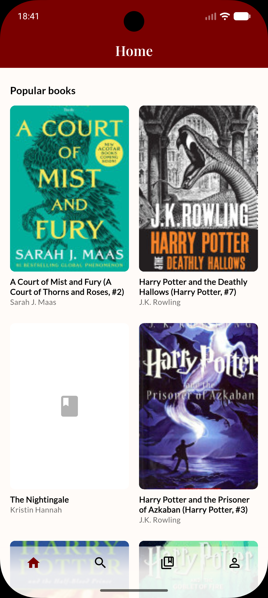
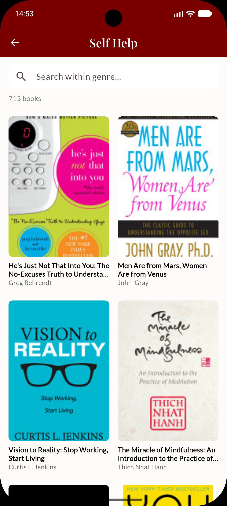
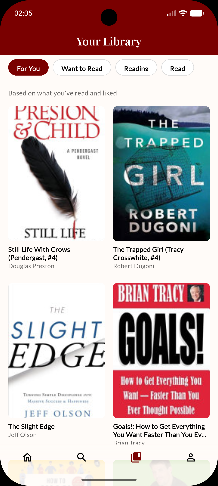
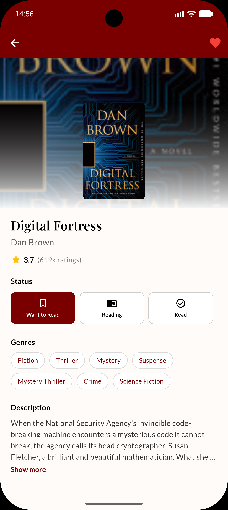

# vivead

> Make your reading life more vivid, one book at a time.

**vivead** is a mobile app for tracking what you read and discovering what to read next. Its recommendation engine is built to serve readers with *diverse* tastes, so a single dominant genre doesn't drown out everything else you like.

  
  
  
  

## Features

- **Google Sign-In** through Firebase Authentication
- **Search** by title or author, or browse by genre
- **Reading status** per book: *Want to Read*, *Reading*, *Read*
- **Favourites**: mark books and genres you love
- **Personalized "For You" feed** based on your library, favourites and reading statuses
- Catalog of ~9,900 books with covers, descriptions, genres and ratings

## Tech Stack

| Layer | Technology |
|---|---|
| Mobile app | Flutter (Dart) |
| Auth & database | Firebase Authentication, Cloud Firestore (NoSQL) |
| Recommendation service | Python, FastAPI, scikit-learn, NumPy |
| Book covers | Google Books API |
| Data pipeline | Python scripts (cleaning, deduplication, cover lookup, Firestore import) |

## How the Recommender Works

The engine is **content-based**: every book is represented as a TF-IDF vector built from its genres and description, and similarity is measured with cosine similarity.

The interesting part is how a user's taste is handled. A common approach averages all of a user's books into one profile vector. That blurs distinct interests together and lets the biggest genre dominate. vivead does something different:

1. **Every book you've interacted with stays a separate reference point.** Statuses and favourites are mapped to weights, so a favourited or finished book counts more than a "want to read" one.
2. **Similarities are rank-normalized per reference book.** Scores are converted to ranks, so each reference book's candidate list is comparable regardless of how densely populated its genre is.
3. **Results are interleaved round-robin.** Each reference book gets a quota proportional to its weight, with a guaranteed minimum so no interest is dropped. The final list alternates between them.

The result is a feed that reflects *all* of your interests, not just the most common one.
